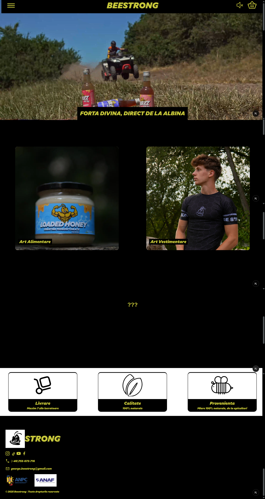
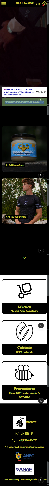

# Beestrong Website

## Table of Contents

- [Overview](#overview)
  - [Screenshot](#screenshot)
- [My Process](#my-process)
  - [What I Learned](#what-i-learned)
  - [Continued Development](#continued-development)
  - [My Tech Stack](#my-tech-stack)
  - [Useful Resources](#useful-resources)

## Overview

### Screenshot

  
  

---

## My Process

### What I Learned

🎯

This is my first time working with a client, which I am so happy and grateful to celebrate! This project pushed me all the way to the limit, I will say that. This experience thought me supabase realtime with edge functions, which I thought they don't exist (also sendgrid email inbox sends), and also efficiency code in web development, how to put a chosen domain in render/vercel, benefits of using shopify and tell the customer that switching to code websites is a better option :), although it's riskier to make a fully functional website! And in top of all that, it made me understand how to use code from before and apply in current projects, for decreasing time spent in development and get the website ready for deployment.

To finish this, the worst thing that I needed to learn was deploying to vercel, instead of render, for more benefits in RAM, and also fetching in the parent of the function that fetches, to get rid of so much time wasted. I deployed the trash efficient version, and I lost my client. The bad result got me unguarded because of the lack of time(just in one day I did all the stock by sizes of the shirts and pants, and the deployment, because of the client's nature to rush at the last mile, instead of watching my work). From now on, I will be more unpatient to phone the client, instead of messaging him, to look at the site.

I learnt a ton, and I will finish this section with the fact that big companies make the website in a specific way. Not for complexity, but for necessity. About this fact and why I include it here, on my social media channels!

---

### Continued Development

🔥

Just get more clients. From communicating with them and tell my thoughts about implementing riches my knowledge of making a higher quality site. Also doing all the functionalities and design with mock images is a life server. I put in my head that I must wait for the images before working on the project. It turned out he gave me the assets the last day, and I have a full day of stressful work, which made me, from lack of time, fail in efficiency of the site, and testing more with my client!

### My Tech Stack

💡

- **Frontend:** Next.js, React, TypeScript
- **Styling & UI:** Tailwind CSS with Shadcn, Daisy UI, Framer Motion
- **Backend & Database:** Prisma, PostgreSQL, Supabase
- **Testing & Validation:** Zod

Staying consistent and improving my skills with these technologies is my top priority! 🚀

---

### Useful Resources

📚

| Resource Name                     | Description                                                                                | Link                                                      |
| --------------------------------- | ------------------------------------------------------------------------------------------ | --------------------------------------------------------- |
| **Vitest Documentation**          | Official documentation for Vitest testing framework.                                       | [Vitest Docs](https://vitest.dev/)                        |
| **TypeScript Documentation**      | Comprehensive guide on TypeScript language features and best practices.                    | [TypeScript Docs](https://www.typescriptlang.org/docs/)   |
| **Tailwind CSS v4 Documentation** | Official documentation for Tailwind CSS version 4, including utilities and configurations. | [Tailwind CSS v4 Docs](https://tailwindcss.com/)          |
| **Framer Motion Documentation**   | Detailed documentation for the Framer Motion library for animations.                       | [Framer Motion Docs](https://www.framer.com/motion/)      |
| **React Documentation**           | Official React documentation covering concepts, hooks, and advanced patterns.              | [React Docs](https://react.dev/)                          |
| **Next.js Documentation**         | Official Next.js documentation covering routing, API routes, and optimizations.            | [Next.js Docs](https://nextjs.org/docs)                   |
| **MongoDB Documentation**         | Official MongoDB documentation for database setup, queries, and best practices.            | [MongoDB Docs](https://www.mongodb.com/docs/)             |
| **Express.js Documentation**      | Guide on using Express.js to build backend APIs with Node.js.                              | [Express.js Docs](https://expressjs.com/)                 |
| **Node.js Documentation**         | Official Node.js documentation for backend development.                                    | [Node.js Docs](https://nodejs.org/en/docs/)               |
| **Jest Documentation**            | Comprehensive guide on testing with Jest, useful for unit and integration testing.         | [Jest Docs](https://jestjs.io/docs/getting-started)       |
| **Testing Library Documentation** | Guide on using React Testing Library for writing accessible tests.                         | [Testing Library Docs](https://testing-library.com/docs/) |
| **Zod Documentation**             | Schema validation library useful for Next.js and TypeScript projects.                      | [Zod Docs](https://zod.dev/)                              |

---

🚀 Happy coding!
